# Draft — local review required

# Label-driven cherry-pick automation: technical design

## Document status and production-readiness verdict

**Production-readiness verdict:** **NOT READY**

This document is the production design candidate for the label-driven
cherry-pick service. The implementation is complete enough for local human
review: its offline engine, GitHub adapters, authorization model, draft-only
writer, workflows, thin callers, deterministic historical replay, and rollback
machinery exist and pass the local gates described below. It is not yet
production-ready because no dedicated GitHub App has been provisioned and no
private GitHub sandbox has exercised installation tokens, real API semantics,
branch compare-and-create, draft recovery, branch rules, or operator rollback.

| Dimension                 | Current state                                                                | Required production evidence                                       |
| ------------------------- | ---------------------------------------------------------------------------- | ------------------------------------------------------------------ |
| Product and design        | PRD, this design, runbook, decision rules, and threat model are local drafts | ROCm DevOps, repository-owner, and security review                 |
| Offline Git core          | Implemented; unit, synthetic, and reviewed historical replay gates pass      | Review of residual historical and semantic-equivalence gaps        |
| GitHub control plane      | Implemented against fake transports; all mutation jobs mechanically disabled | Private-sandbox App, API, permission, retry, and audit-log results |
| Source-repository callers | Implemented and locally tested with an intentionally stale rockrel pin       | Regeneration from the reviewed immutable rockrel revision          |
| Production configuration  | Train is `validate`; executor App ID is null; trusted App list is empty      | Approved App identity, secrets, labels, rules, and rollout modes   |
| Operational readiness     | Local rollback and partial-write paths are tested                            | Pilot SLOs, alerting, incident drill, ownership, and go/no-go      |

No text in this document overrides the safety boundary. “Production design”
describes the intended architecture, not authorization to deploy it. Every
remote step remains queued in `REMOTE_ACTIONS_TODO.md`, and every generated PR
must remain a draft until a human explicitly marks it ready.

Companion review artifacts are the
[product requirements](product-requirements.md),
[implementation audit](implementation-report.md),
[TDD evidence](tdd-evidence.md),
[historical replay analysis](historical-replay-analysis.md),
[operator runbook](runbook.md), and
[remote-action checklist](REMOTE_ACTIONS_TODO.md). This document is the
architectural source of truth; those files provide the product contract,
measured evidence, and operational procedure.

## Safety boundary

All implementation and test execution in this phase is local. Tests use
filesystem Git remotes and fake HTTP adapters. The explicitly requested
operator `local-materialize` validation may read GitHub metadata and fetch exact
Git refs, but it cannot push or publish status. No command may dispatch Actions,
change App configuration, apply labels, publish Checks/comments, or create
public pull requests. Future remote writes are recorded, not executed, in
`REMOTE_ACTIONS_TODO.md`.

The implementation contains production-capable interfaces, but all checked-in
trains remain `validate` or disabled, the App manifest webhook is inactive, and
every workflow job capable of mutation has a literal impossible-repository
predicate. No environment variable alone turns the ordinary offline CLI into a
remote writer.

## End-to-end architecture

### System context and trust zones

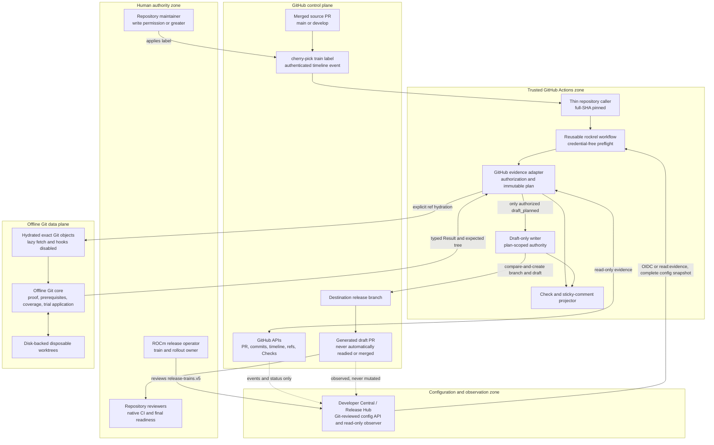

Solid arrows are control or data paths owned by this product. Dotted arrows are
observation paths. Developer Central supplies only reviewed configuration and
never authorizes the label or performs a GitHub write. Untrusted source-PR code
is data only and never executes in the trusted `pull_request_target` context.

### Repository and runtime topology

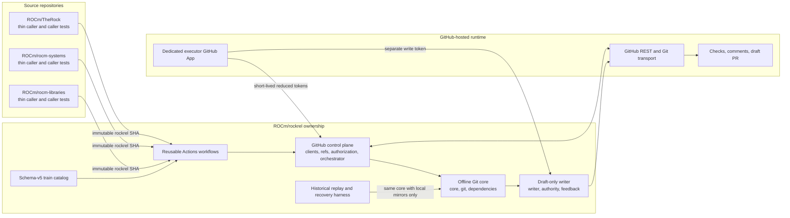

### Immutable evidence and capability chain

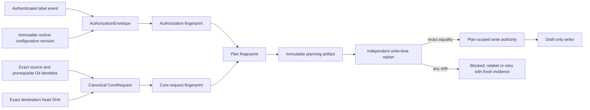

This chain is the central security invariant: a label authorizes one exact
source head, body, dependency graph, configuration revision, destination head,
and resulting Git plan. It is not a standing permission to cherry-pick whatever
the PR later becomes.

`rockrel` owns train configuration, the offline Python core, GitHub adapters,
the reusable workflow, reconciliation, and the draft writer. TheRock,
rocm-systems, and rocm-libraries contain only generated thin callers and
repository-native contract tests. Release Hub is outside the control plane and
remains a read-only observer of GitHub and release evidence.

The operating model remains mainline-first: a change must be merged to the
configured source branch before it can be requested for a destination branch.
The current catalog uses `main` for TheRock and `develop` for rocm-systems and
rocm-libraries, but the engine validates the per-repository configuration and
does not hard-code those branch names.

The Python package is split by responsibility:

1. `models` and `config`: immutable versioned contracts.
1. `git`: local PR/standalone-commit proof, prerequisite containment,
   existing-PR coverage, preflight, and materialization; imports no API client.
1. `dependencies`: exact PR/full-commit trailer parsing and immutable DAG
   validation.
1. `authorization`: pure evaluation of already-fetched label/timeline facts.
1. `clients`, `refs`, and `git_auth`: GitHub transport, exact-ref hydration,
   and process-scoped Action Git authentication; absent from the core CLI.
1. `orchestrator`: converts validated GitHub facts into a `CoreRequest`, invokes
   the core, and combines authorization/control-plane evidence.
1. `writer`: receives a fresh authorized plan and an explicit production write
   authority; it materializes through the core and publishes a draft only.
1. `action_runtime` and `feedback`: GitHub-Actions-only transport/capability
   boundaries and typed Check/comment projection.

Jira client types, parsing, secrets, configuration, templates, and workflow
inputs are removed from this package. The offline Git core receives only an
immutable request and imports no Release Hub client. The surrounding control
plane and read-only Marketplace adapter call Release Hub only to obtain the
complete authenticated configuration snapshot.

## End-to-end execution flows

### Initial label event: discovery, authorization, and planning

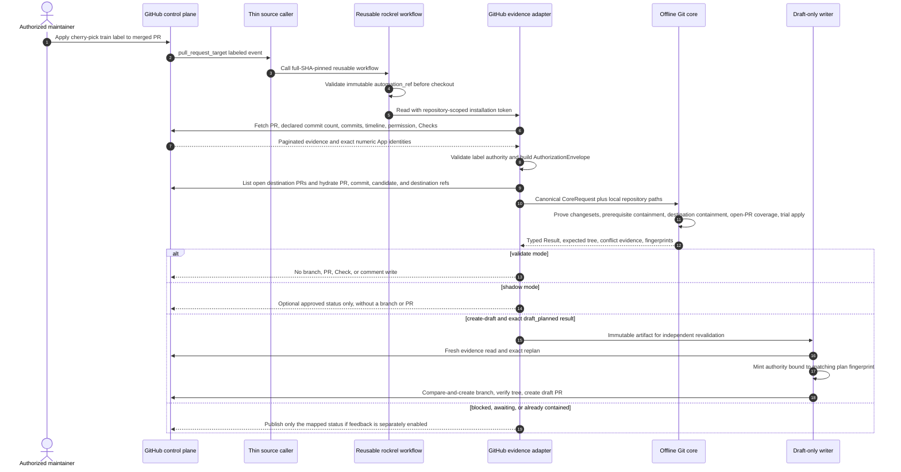

The label is a request, not proof of eligibility. Eligibility is established
only after current permission, merge state, source branch, exact Git objects,
prerequisites, destination state, and configuration have all been proven.

### Continuation and reconciliation: preserve label-time intent

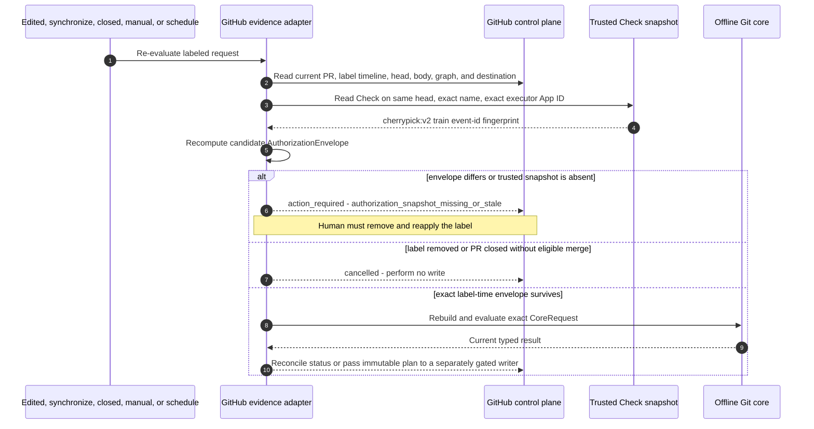

Reconciliation cannot turn an old label into authorization for a changed PR.
The exact executor-App Check external ID is durable authorization state; a
freshly recomputed envelope is accepted only when it equals that state.

### Draft transaction, idempotency, and partial recovery

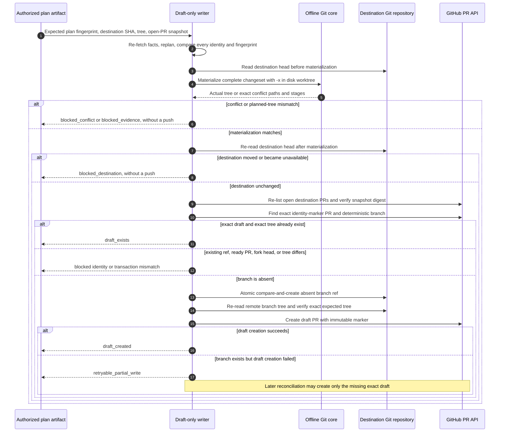

The transaction deliberately never force-pushes, updates an existing ref,
deletes a branch, closes a PR, marks a PR ready, approves, or merges. GitHub
does not offer a single transaction spanning base-head observation, ref
creation, and PR creation; exact-tree verification and idempotent partial
recovery make each visible intermediate state safe for human inspection.

### Offline core decision graph

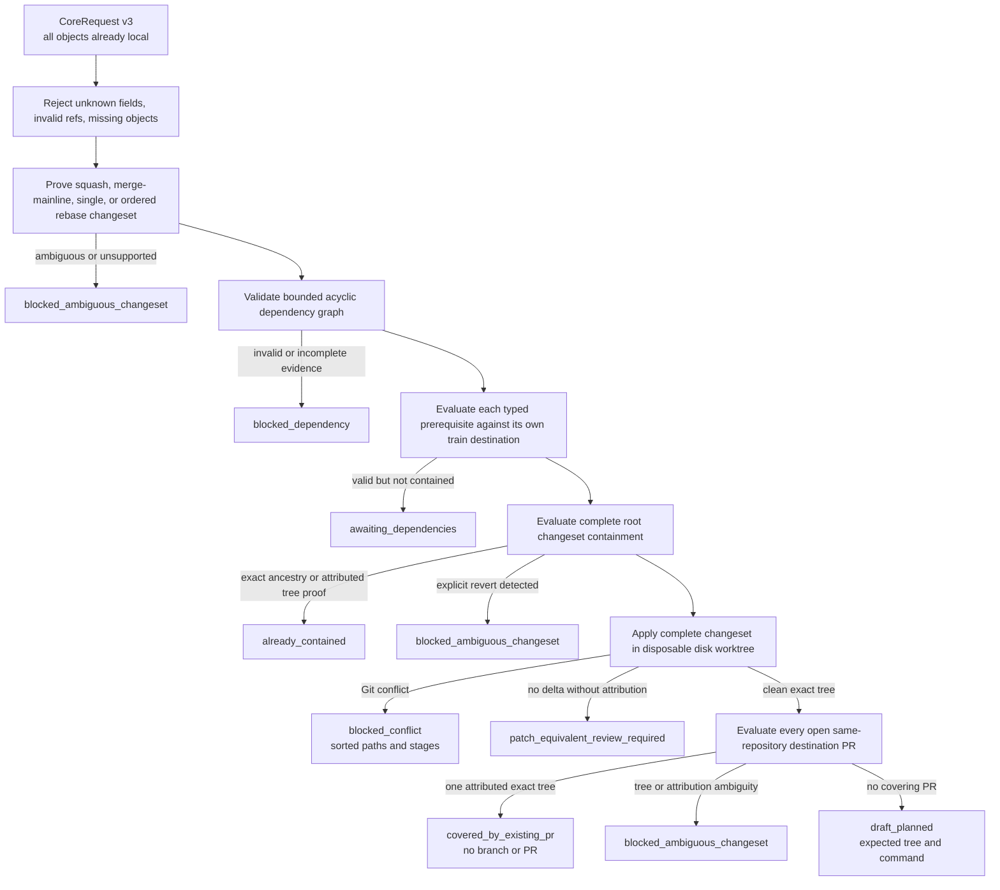

### Cross-repository dependency evaluation

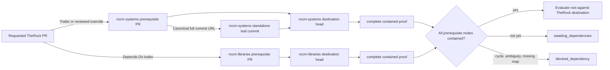

The graph controls ordering but does not create prerequisite drafts. A root
request advances only after every prerequisite is independently merged and
contained in its own configured destination. This avoids presenting a
multi-repository operation as atomic when it is not.

### Request and result lifecycle

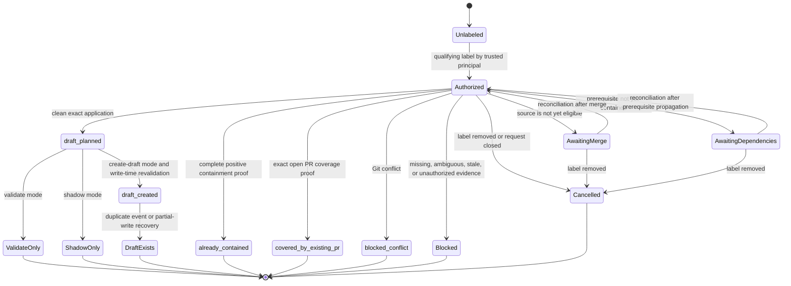

Results are observations of immutable evidence, not mutable workflow phases.
Any retry starts by reading and proving the current world again; it does not
resume from an in-memory assumption.

### Result and write decision table

| Proven condition                                                          | Typed result                  | Remote branch or PR write  | Operator meaning                                                   |
| ------------------------------------------------------------------------- | ----------------------------- | -------------------------- | ------------------------------------------------------------------ |
| Label absent/removed, disabled train, or closed request no longer applies | `cancelled`                   | Never                      | Stop; a new label transition is a new request                      |
| Source base is outside the configured mainline                            | `ineligible_source`           | Never                      | Merge through the configured source branch first                   |
| Source PR is valid but not merged                                         | `awaiting_merge`              | Never                      | Reconciliation may retry after merge                               |
| Label actor/App is not authorized or snapshot is stale                    | `blocked_authorization`       | Never                      | Correct authority or remove/reapply the label                      |
| API/ref/config evidence is missing, capped, malformed, or changed         | `blocked_evidence`            | Never                      | Restore trustworthy evidence; do not infer                         |
| A promisor checkout lacks an object required for proof                    | `blocked_evidence / local_objects_incomplete` | Never          | Hydrate the checkout; retain Git stderr and rerun                   |
| Prerequisite graph is invalid or ambiguous                                | `blocked_dependency`          | Never                      | Correct trailers/override or obtain manual review                  |
| Prerequisites are valid but not all contained                             | `awaiting_dependencies`       | Never                      | Land prerequisites in topological order; reconciliation will retry |
| Changeset representation or equivalence is ambiguous                      | `blocked_ambiguous_changeset` | Never                      | Component owner performs semantic review                           |
| Complete application conflicts                                            | `blocked_conflict`            | Never                      | Resolve manually in a separately reviewed draft                    |
| Exact complete containment is positively proven                           | `already_contained`           | Never                      | Do nothing; record the proof                                       |
| Exactly one open destination PR has source attribution and planned tree   | `covered_by_existing_pr`      | Never                      | Reuse and review that manual or automated PR                       |
| Multiple exact PRs, an unattributed equal tree, or attributed wrong tree  | `blocked_ambiguous_changeset` | Never                      | Inspect candidates; the engine cannot choose safely                |
| Exact automation marker, branch, and tree already exist during recovery   | `draft_exists`                | Never                      | Reuse the existing automation draft                                |
| Exact clean application under `validate` or `shadow`                      | `draft_planned`               | Never                      | Compare decisions; no branch/PR creation                           |
| Exact clean application under approved `create-draft` and fresh replan    | `draft_created`               | One absent ref + one draft | Review diff and native CI; remain draft                            |
| Branch creation succeeded but draft API failed                            | `retryable_partial_write`     | Branch already exists      | Reconcile only the missing exact draft; never overwrite            |

## Versioned contracts

### Release-train policy v5 and cherry-pick config v1

The Git-reviewed source is ROCm Release Hub `config/release-trains.json` with
`schemaVersion: release-trains.v5`. Global `automation.cherryPick` owns
source-branch eligibility, authorization, limits, and GitHub OIDC trust. An
eligible train owns its label, mode, dependency mode, and reviewed prerequisite
overrides; destination branches are projected exclusively from that same
train `branches` array. The read-only API emits the following complete
`cherry-pick-config.v1` shape. Top-level projection keys are exactly
`schema_version`, `authorization`, `dependency_policy`,
`coverage_policy`, and `trains`.

```json
{
  "schema_version": 5,
  "authorization": {
    "minimum_human_permission": "write",
    "trusted_app_ids": [],
    "executor_app_id": null
  },
  "dependency_policy": {
    "max_nodes": 64,
    "max_depth": 16
  },
  "coverage_policy": {
    "max_open_pull_requests": 128
  },
  "trains": [
    {
      "id": "10.1-20260811",
      "label": "cherry-pick:10.1-20260811",
      "state": "active",
      "mode": "validate",
      "dependency_mode": "gate",
      "prerequisite_overrides": [
        {
          "source_pr": "https://github.com/ROCm/rocm-systems/pull/9716",
          "rationale": "Maintainer-reviewed prerequisite sequence.",
          "edges": [
            {
              "from": "https://github.com/ROCm/rocm-systems/pull/9716",
              "to": "https://github.com/ROCm/rocm-systems/pull/9480"
            }
          ]
        }
      ],
      "repositories": {
        "ROCm/TheRock": {
          "source_branches": ["main"],
          "destination_branch": "release/bkc/therock-10.1-20260811"
        }
      }
    }
  ]
}
```

- Human permissions are ordered `none < read < triage < write < maintain < admin`; the only accepted configured minimum in v1 is `write`.
- Trusted App IDs are unique positive integers. Slugs and bot logins are not
  identities.
- `executor_app_id` is null only for local/`validate` operation. Automated
  modes require the exact positive numeric ID of the App allowed to persist
  authorization Checks; it is independent of label-writer allowlisting.
- Dependency limits are fixed to safe configured bounds: `max_nodes` 1–64 and
  `max_depth` 1–16.
- Coverage discovery is fail-closed and bounded to 1–128 normalized open pull
  requests that target the exact destination branch.
- `prerequisite_overrides` are reviewed train configuration, not runtime user
  input. Each override requires a canonical source PR, non-empty rationale,
  reachable acyclic edges, configured repositories, and commit leaves. It is
  additive with current `Depends-On:` trailers and is bound by the immutable
  configuration revision in authorization.
- Repositories remain restricted to TheRock, rocm-systems, and rocm-libraries.
- Branches use `git check-ref-format --branch`; no naming prefix is assumed.
- Unknown or legacy fields, including `requirements`, `jira_fix_version`, and
  `block_on_dependencies`, fail loading.
- The Developer Central response carries the exact source digest, ETag, request
  ID, and no-store cache policy. Runtime callers do not load a bundled catalog
  or infer any branch.

### CoreRequest schema v3

The GitHub adapter serializes a canonical JSON object:

```text
schema_version: 3
dependency_mode: gate | managed_stack
train_id: string
source: PullRequestNode (including its DestinationNode)
prerequisites: [PullRequestNode | CommitNode]
prerequisite_edges: [{from, to}]
coverage_candidates: [CoverageCandidate]
```

`PullRequestNode` contains canonical PR URL, repository, positive PR number,
source base branch, full lowercase head/merge SHAs, ordered full commit SHAs,
PR-body SHA-256, and that repository's `DestinationNode`. A `CommitNode`
contains a canonical full lowercase commit URL and SHA plus its destination;
the core accepts it only when Git proves a standalone one-parent changeset.
`DestinationNode` contains repository, validated branch, and full immutable
head SHA. Prerequisites are emitted in deterministic topological order and
edges are sorted and deduplicated.

Each `CoverageCandidate` freezes a canonical open PR URL/number, draft state,
exact base branch/SHA, and same-repository head SHA. The adapter discovers the
complete bounded set of same-repository open PRs targeting the destination.
The core does not trust title, body, label, Jira, or automation marker as
coverage: it proves destination ancestry, source attribution, and exact final
tree from local Git objects. The canonical candidate array has its own digest
for the writer's final race guard.

The manifest contains no token, filesystem path, Jira field, GitHub permission,
network client, or mutable API object. Local repository paths are provided separately as
`OWNER/REPO=PATH`. Parsing rejects unknown fields and requires every referenced
object to resolve locally with lazy fetch disabled.

The canonical manifest digest is the `core_request_fingerprint`. The
`plan_fingerprint` is a second SHA-256 digest binding that request to the exact
self-authenticating authorization envelope, which already includes the rockrel
configuration revision. JSON serialization uses sorted keys, UTF-8, and compact
separators so repeated and parallel runs are byte-identical.

### AuthorizationEnvelope

The GitHub control plane, not the core, produces:

```text
train_id, label, label_event_id, label_event_node_id, labeled_at,
actor_id, actor_login, actor_permission, performed_via_app_id,
source_head_sha, source_body_sha256, dependency_snapshot_sha256,
config_revision, fingerprint
```

The envelope is bound to the latest label transition. A per-train Check Run on
the source head stores `cherrypick:v2:<train>:<event-id>:<fingerprint>` as its
external ID. Updates may change Check status/output but never the authorization
fingerprint. On `edited`, `synchronize`, `closed`, or reconciliation/manual
continuation, the adapter recomputes the candidate envelope and accepts it only
when that exact external ID already exists on the same head, under the exact
configured numeric executor App ID. A missing, foreign-App, or stale snapshot
blocks and requests relabeling.

### Result schema

`Result` retains stable identity/evidence fields and adds:

```text
awaiting_dependencies
blocked_authorization
```

The Jira-oriented `blocked_policy` status is replaced by explicit
authorization, evidence, dependency, or destination reason codes. Every
post-merge result records destination head, changeset kind, ordered commits,
proof method, dependency node outcomes, planned tree when available, and plan
fingerprint. Conflicts record sorted paths and stages. Unknown status or
malformed evidence fails deserialization.

## GitHub event, authorization, and ref acquisition

The thin caller uses `pull_request_target` for `labeled`, `unlabeled`, `edited`,
`synchronize`, and `closed`. Rockrel separately owns manual dispatch and a
six-hour reconciliation schedule. The caller passes the canonical source URL
and event facts to a reusable workflow pinned to a full rockrel SHA. The
reusable reference, checkout reference, and explicit `automation_ref` must be
identical.

A versioned `rocm-cherry-pick-integration.v2` manifest carries the reviewed
cross-repository trust anchors and immutable pins. The local five-repository
checker compares that manifest with rockrel, Release Hub, TheRock,
rocm-systems, and rocm-libraries. A passing result proves configured cross-file
equality for the endpoint, OIDC issuer/audience, canonical numeric identities,
per-caller event/ref/workflow tuple, immutable-only subject policy, and full
rockrel SHA. It does not execute token exchange or prove verifier,
authorization, or workflow semantics. Those behaviors are owned by the Release
Hub OIDC/configuration suites and the rockrel workflow/adapter suites.

A credential-free preflight job rejects a non-SHA automation revision before
any checkout. For `workflow_dispatch`, the requested automation revision must
equal `github.sha`, preventing a dispatcher from selecting different
unreviewed automation code. Reusable callers remain protected by their tested
equality between the reusable-workflow reference and `automation_ref`.

The verifier accepts only audience
`api://developer-central.amd.com/rocm-cherry-pick-config` and owner `ROCm` ID
`21157610`. Repository IDs are TheRock `765605091`, rocm-systems `962090208`,
rocm-libraries `971570345`, and rockrel `1071689640`. No name-only identity is a
fallback. The three source callers allow only `pull_request_target`; `base_ref`
must equal their configured `main` or `develop` branch and `ref` must equal
`refs/heads/<base_ref>`. They require immutable
`repo:ROCm@21157610/REPOSITORY@repository_id:pull_request` subjects plus exact
`job_workflow_ref` and `job_workflow_sha` for the pinned reusable
`ROCm/rockrel/.github/workflows/cherry_pick.yml@<sha>`.

Direct rockrel schedule/workflow-dispatch tuples use only `refs/heads/main`,
subject `repo:ROCm@21157610/rockrel@1071689640:ref:refs/heads/main`, and exact
`workflow_ref`/`workflow_sha`; `job_workflow_*` is not accepted as a substitute
for direct jobs. Behavioral tests reject missing, abbreviated, mutable,
cross-tuple, or inconsistent identities as well as signature, issuer, event,
repository, ref, subject, time, and key failures. GitHub's
[official OIDC reference](https://docs.github.com/en/actions/reference/security/oidc)
says repositories created before 2026-07-15 require authorized opt-in to
immutable repository identities in the subject. Verifying and, where required,
enabling that remote setting is an unchecked production TODO, not local
evidence.

The trusted workflow never checks out or runs source-PR files. The GitHub
adapter:

1. Fetches the canonical PR, all PR commits, and every page of issue timeline.
1. Selects the latest matching `labeled`/`unlabeled` transition and verifies the
   label is currently present.
1. Authorizes a human only when a fresh collaborator-permission lookup is at
   least `write`; authorizes an App only by exact numeric
   `performed_via_github_app.id` in configuration.
1. Parses typed prerequisites from the current body, adds only matching
   reviewed train-config overrides, and freezes body/head/graph digests in the
   envelope.
1. For any continuation, proves the candidate envelope equals the trusted
   label-time Check snapshot; a changed body, head, dependency graph, config, or
   label event cannot silently mint a replacement envelope.
1. Validates the source base, source merge state, destination branch, and
   effective pull-request rule.
1. Lists every page of open PRs targeting the destination, rejects a snapshot
   above the configured cap, normalizes same-repository candidates, and binds
   their exact identities into `CoreRequest`.
1. Fetches the exact source merge SHA, `refs/pull/<N>/head`, every original
   source commit, prerequisite PR/commit objects, open coverage-candidate heads,
   and exact destination heads using explicit refspecs. This handles source
   fork PRs without trusting fork workflows.
1. Invokes the offline core only after all objects exist locally.

All list endpoints paginate to exhaustion. Retryable 429, rate-limit 403, 502,
503, and 504 responses use bounded injected backoff. Search results with
`incomplete_results`, totals beyond GitHub's 1,000-result Search cap, malformed
totals, or a PR commit-list length different from the Pull API's declared
commit count return blocked evidence. Missing pages, other malformed payloads,
or unavailable refs also block. Credential-bearing GitHub and Release Hub
transports refuse redirects and bound success and error bodies to 2 MiB plus one
detection byte; oversized bodies are rejected without disclosure.

Before a write, a separate job re-fetches and revalidates the current label,
latest event, actor/App authority, source head/body/graph, merge SHA, train
config revision, destination SHA, branch, and existing draft. The write-time
Action compares the entire expected result with a fresh plan and mints a
capability bound to the exact authorized plan fingerprint. After materializing
and re-reading the destination, the writer independently re-lists open
destination PRs and compares the normalized snapshot digest immediately before
the first possible push. A standalone commit instead binds the canonical digest
of an empty coverage snapshot, so unrelated open pull requests cannot become
mutable evidence; a non-canonical snapshot blocks before any write. Any drift
blocks or replans; source/graph drift requires relabeling. The CLI accepts every declared
caller event (`labeled`, `unlabeled`, `edited`, `synchronize`, and `closed`) so
this check cannot be skipped by an event/parser mismatch.

## Prerequisite graph

Request-body prerequisite syntax is a repeated footer trailer whose value is
either a canonical PR URL or canonical full lowercase commit URL:

```text
Depends-On: https://github.com/ROCm/<configured-repository>/pull/<number>
Depends-On: https://github.com/ROCm/<configured-repository>/commit/<40-lowercase-hex>
```

The parser feeds the PR body to `git interpret-trailers --parse`, selects exact
case-insensitive `Depends-On` keys, and validates/canonicalizes each value using
the GitHub PR response or exact local commit identity. It rejects fragments,
query strings, issue URLs, bare or abbreviated SHAs, uppercase SHAs, non-HTTPS
hosts, non-ROCm owners, and unsupported repositories. A reviewed
`prerequisite_overrides` entry may add missing edges for a known train/source
pair; it uses the same strict URL and DAG contracts, requires rationale, and is
authorization-bound configuration rather than PR-authored evidence.

The GitHub adapter resolves transitive PR metadata; the pure DAG builder then:

- deduplicates edges and nodes;
- rejects self-dependencies and cycles;
- enforces 64 total nodes and depth 16;
- requires a same-train destination mapping for every repository;
- requires commit nodes to be leaves; and
- emits deterministic topological order independent of API response order.

Each PR prerequisite must be merged and have a complete proven changeset. Each
commit prerequisite must resolve exactly and be a proven single-parent
standalone changeset. The core evaluates every node against the exact reviewed
destination. In `gate` mode a valid unmet node produces
`awaiting_dependencies`. In `managed_stack` mode the core emits a
deterministic frontier containing only nodes whose own prerequisites are
already exactly contained; one exact existing draft is reused and multiple
exact candidates block. Reconciliation waits for exact containment before
advancing the next topological wave. A cycle, unsupported mapping, ambiguous
changeset, or required synthesized gitlink bump produces `blocked_dependency`.
A missing promisor object preserves `blocked_evidence /
local_objects_incomplete` at the top level. The product never updates, readies,
merges, closes, or deletes a prerequisite draft and does not promise atomic
cross-repository writes.

## Git proof and materialization

All Git commands use argument arrays, `shell=False`, `GIT_NO_LAZY_FETCH=1`,
`GIT_TERMINAL_PROMPT=0`, and `core.hooksPath=/dev/null`. Scratch roots must be
disk-backed, writable, and selected by the trusted caller. `CorePlanner`
propagates its optional scratch root through dependency, root, and attributed
containment trials; the standalone workflow supplies it explicitly. Embedded
tests/callers that omit it fall back to the repository's parent filesystem,
not the process-wide temporary directory. Source repositories are treated as
data; no submodule initialization, filter driver, or hook is run.

### Changeset representations

- **Merge commit:** prove two parents and the complete PR integration tree;
  application uses `git cherry-pick -x -m 1 <merge>`.
- **Single/squash:** prove the merged commit delta equals the complete PR delta;
  application uses `git cherry-pick -x <merge>`.
- **Rebase:** walk the canonical commit count backward, prove ordered normalized
  patch identities and aggregate tree delta, and apply oldest to newest.
- **Standalone commit prerequisite:** require exactly one parent and apply the
  exact full commit with `git cherry-pick -x`.
- **Unknown:** octopus merges, intervening-history ambiguity, tree/patch
  mismatch, or uncertain bases return `blocked_ambiguous_changeset`. Missing
  promisor objects return `blocked_evidence / local_objects_incomplete` with
  bounded Git stderr because the local checkout, not the source representation,
  is incomplete.

Containment permits only positive complete-change proof:

1. Every exact application unit is an ancestor of the destination; or
1. A reachable first-parent destination commit carries strong source identity
   and reapplying the complete source to that commit's parent exactly reproduces
   its tree, with no later explicit revert.

An otherwise clean complete application that produces no tree delta, but lacks
exact ancestry or attributed destination provenance, is
`blocked_ambiguous_changeset / patch_equivalent_review_required`. A conflict,
partial commit ancestry, title/Jira similarity, or Release Hub nightly status is
never containment. Gitlink changes additionally require exact superproject
application or directional component ancestry with strong provenance; they are
never inferred from a newer unrelated nightly.

`evaluate_changeset` and `DraftWriter` share the validated
`cherry_pick_command` builder, including commit order and merge mainline rules.
Planning records the expected tree. Writing independently rematerializes from
the exact destination using the write form (`-x`) and must reproduce that tree
before a branch push or PR API call.

## Draft transaction and GitHub feedback

The security boundary is the scoped token available only in the write job, not
an in-process Python object. Code still requires an injected
`DraftWriteAuthority` to prevent accidental calls, but production constructs it
only in the trusted Action entrypoint; tests inject a fake publisher protocol.

Writer identity is source repository, source PR, train, and plan fingerprint.
The exact identity marker is required in an existing active PR; an open PR must
also still be a draft and belong to the destination repository, not a same-name
fork branch. The branch is deterministic and Git-valid. Transaction steps are:

1. Require train mode `create-draft`, `draft_planned`, a self-authenticating
   authorization envelope, and exact authorized plan fingerprint.
1. Repeat all GitHub and Git boundary revalidations.
1. Materialize through the core and compare the expected tree.
1. Re-read the destination head after materialization and before any push;
   block if it moved or became unavailable.
1. Re-list all open destination PRs and require exact equality with the
   plan-time normalized coverage snapshot; block if a PR appeared, disappeared,
   changed head, base, repository ownership, state, or draft state.
1. Inspect exact branch/head/base and identity-marker PR state.
1. Reuse an existing exact tree; block any mismatch.
1. Atomically compare-and-create an absent branch ref. The compare condition is
   that the remote ref does not exist; no existing ref can be updated.
1. Re-read and verify the remote tree.
1. Create a pull request with `draft: true` and immutable identity marker.
1. Upsert the Check and, only when useful, one marker-delimited comment.

If branch creation succeeds but PR creation fails, return
`retryable_partial_write`. Reconciliation creates only the missing draft after
reproving identity/tree. Check/comment failure after draft creation is likewise
retryable and never rolls back or deletes the draft. Concurrent exact work is
idempotent; concurrent different work blocks.

The draft body contains source/destination SHAs, train, representation, proof,
ordered `-x` command, expected tree, dependency graph, local preflight, CI
disclaimer, and operator checklist. It contains no Jira section and never
claims CI success.

Check mapping:

| Result family                                             | Check conclusion  |
| --------------------------------------------------------- | ----------------- |
| `already_contained`, `draft_created`, `draft_exists`      | `success`         |
| `awaiting_merge`, `awaiting_dependencies`, shadow plan    | `neutral`         |
| conflict, invalid graph, authorization/evidence ambiguity | `action_required` |
| label removed or train disabled                           | `cancelled`       |

## Workflows and App permissions

The executor App's maximum installation permissions are metadata read,
contents write, pull requests write, issues write, and checks write. It does not
request administration, actions, workflows, deployments, members, or secrets.
The read job mints a repository-scoped token reduced to metadata/contents/PR/
issues read. The write job mints a new token reduced to the necessary write
permissions only after a writable plan. It retains Checks read solely to prove
the trusted label-time authorization snapshot during the independent
write-time replan. Tokens are never passed between jobs.

Caller workflows remain rendered and disabled locally. They request no Jira
secret and cannot activate a stale central pin. Rockrel must be reviewed and
published first; only its resulting immutable SHA may be rendered into caller
changes during a separately approved step.

### Developer Central and Release Hub boundary

Release Hub loads `release-trains.v5` as immutable Git-reviewed policy and
projects the complete cherry-pick subset through
`GET /api/v1/cherry-pick/config`. A safe-default-off feature flag protects the
new API. Local users authenticate with an owner-bound `read:evidence` token;
Actions uses a short-lived GitHub OIDC assertion bound to reviewed issuer,
audience, owner, repository, ref, and reusable-workflow claims. The endpoint
returns no GitHub credential and performs no mutation.

Release Hub may also ingest and display request labels, Check results, draft
links, propagation, and readiness evidence. It MUST NOT mint executor App
tokens or write labels, Checks, comments, branches, or PRs. GitHub App
installation tokens are minted and used only inside the trusted Actions jobs.
The pure Git core imports neither Release Hub nor GitHub clients.

## Threat model

### Assets, adversaries, and trust assumptions

Protected assets are the integrity of the destination release branch, the
meaning of a maintainer's label authorization, executor App credentials,
immutable automation/configuration revisions, source and dependency identity,
the generated branch tree, draft-PR identity, and the audit evidence used by
operators. Availability matters, but integrity wins: uncertain evidence blocks
instead of guessing.

Potential adversaries include an untrusted source-PR author, a repository user
without write permission, a compromised or misconfigured label-writing App, a
malicious fork, a process attempting to inject Git hooks/filters/credentials,
replayed or out-of-order GitHub events, a stale caller pin, and concurrent
automation executions. A fully compromised GitHub control plane, repository
administrator, runner host, executor App private key, or reviewed rockrel
revision is outside the system's ability to contain; those are platform and
organizational trust roots and require credential rotation, rulesets, audit
logs, and incident response.

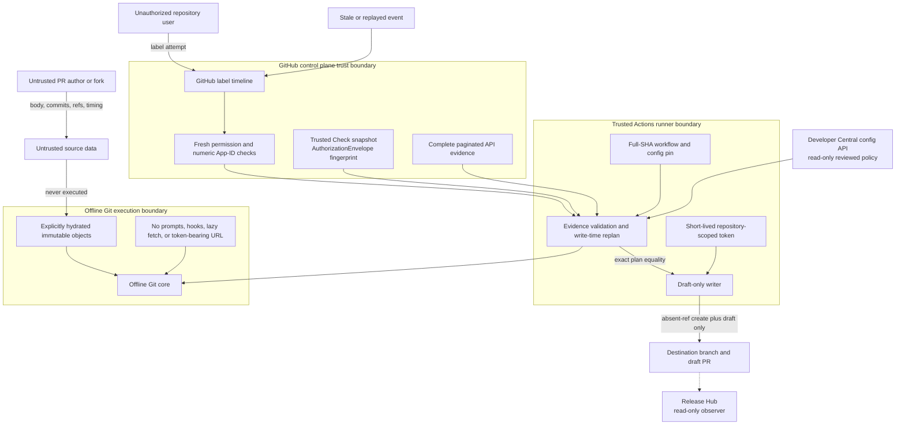

### STRIDE analysis and enforced controls

| Category               | Representative threat                                                                    | Preventive or detective control                                                                                       | Residual risk / operational response                                                        |
| ---------------------- | ---------------------------------------------------------------------------------------- | --------------------------------------------------------------------------------------------------------------------- | ------------------------------------------------------------------------------------------- |
| Spoofing               | Bot login, display name, or stale permission impersonates a trusted labeler              | Fresh collaborator permission or exact numeric `performed_via_github_app.id`; separate numeric executor App ID        | Compromised trusted account/App requires GitHub audit review and credential revocation      |
| Tampering              | PR head, body, prerequisites, config, destination, or open-PR set changes after labeling | Envelope/snapshot digests, immutable config SHA, exact replan, two base reads, final open-PR snapshot comparison      | Base may move after the second read; resulting object remains a draft and exposes its SHAs  |
| Repudiation            | Operator cannot explain why a branch or draft exists                                     | Label event/node IDs, actor/App identity, source/destination SHAs, plan fingerprint, `-x`, Check, immutable PR marker | GitHub audit-log retention and ownership must be validated in the sandbox                   |
| Information disclosure | Installation token appears in URL, command arguments, artifact, log, or another job      | Separate short-lived tokens, reduced permissions, process-local extraheader, no token-bearing URL/artifact transfer   | Runner/platform compromise remains a trust-root incident                                    |
| Denial of service      | API truncation, rate limit, huge dependency graph, retry storm, or intentional race      | Pagination, completeness/count checks, bounded retry/backoff, node/depth limits, concurrency plus idempotency         | Safe fail-closed behavior can delay a train; operators need alerts, retry budget, and SLOs  |
| Elevation of privilege | Untrusted PR code runs in `pull_request_target` or ordinary CLI constructs authority     | No source-head checkout/execution; credential-free preflight; Action-only transport and authority construction        | A malicious reviewed rockrel revision is a supply-chain compromise                          |
| Supply-chain tampering | Caller references moving workflow code or dispatch selects a different revision          | Full 40-character Action pins, caller/ref/config equality, manual-dispatch SHA binding                                | Callers must be regenerated only after the central reviewed revision exists                 |
| Git execution abuse    | Hooks, filters, prompts, lazy fetch, ref ambiguity, or crafted branch input executes     | Argument arrays, `shell=False`, hooks disabled, no lazy fetch/prompts, exact refspecs, `check-ref-format`             | Git implementation vulnerabilities are inherited platform risk                              |
| Evidence confusion     | Partial commits, patch similarity, nightly propagation, or gitlink rollup looks done     | Complete changeset proof; directional attributed tree proof; ambiguous no-op and unsupported rollup block             | Some semantic equivalence still requires human component-owner review                       |
| Transaction collision  | Concurrent run or manual PR creates duplicate coverage or targets the wrong PR           | Git-proven open-PR coverage, final candidate snapshot, deterministic marker/head/base/tree, absent-ref creation       | A PR or base can still move after its last read; draft review and native CI remain required |

### Abuse-case decisions

- A source author editing `Depends-On:` after the label cannot expand the
  approved operation; the snapshot differs and relabeling is required.
- A fork PR with the deterministic branch name cannot be mistaken for the
  destination repository's branch because repository ownership, head, base,
  draft state, and identity marker are all exact-match requirements.
- A partial GitHub Search result or shortened commit list cannot authorize an
  operation; it returns blocked evidence.
- A cherry-pick conflict never means “already present.” It returns
  `blocked_conflict` with exact paths/stages and performs no push.
- A patch-equivalent empty application without source attribution is not
  silently skipped; it requires semantic review.
- A dependency cycle, unsupported repository, unavailable ref, moved
  destination, ready existing PR, or mismatched remote tree blocks.
- A manual or automated open PR suppresses a new draft only when its head
  descends from the planned destination, has exact source attribution, and has
  the exact planned tree. One exact candidate is reused; multiple exact or
  ambiguous candidates block.
- An open destination PR changing between planning and the final writer check
  blocks before any push, even if the source and destination heads are stable.
- A branch created immediately before a PR API failure is not deleted or
  overwritten. Reconciliation proves the same identity and tree before
  creating only the missing draft.
- Release Hub policy selects reviewed trains and branches but cannot authorize
  a label or mutate GitHub. Git proves containment and the label snapshot plus
  current permission authorizes a request.

## TDD and verification

Implementation order is enforced:

1. PRD, technical design, decision table, runbook, and threat model.
1. All new tests and a recorded red run.
1. Core/config/Jira-removal implementation.
1. Dependency and authorization implementation.
1. GitHub runtime/workflow and writer implementation.
1. Targeted green runs, full tests, replay, coverage, lint/format/build, and
   evidence documentation.

Every behavior and failure branch gets a unit test. Integration tests use fake
paginated GitHub responses and local bare remotes. Workflow tests inspect
permissions, immutable pins, events, absence of Jira, and absence of source-head
execution. Static boundaries prove the product does not add a Release Hub
writer or dependency.

Coverage gates are 95% lines and 90% branches overall, with at least 90% lines
and branches for every changed safety-critical module. Coverage percentages are
read from JSON without display rounding.

## Historical replay and recovery

Discovery inventory, human-reviewed oracle, and execution remain separate.
Candidate generation cannot update the golden fixture.

For each strict case the core starts from the parent immediately before the
known-good destination cherry-pick, materializes the complete source, and
compares exact trees. It then evaluates the known-good result and pinned tip and
requires positive `already_contained` proof. Conflicts require exact path/stage
evidence and no write.

The current 77-row corpus is reported honestly: 31 strict exact cases, three
conflict diagnostics, five adaptation/evidence-gap rows, and 38 inventory-only
rows. Only executed strict rows form the pass denominator. Reconstructable
inventory cases are promoted after independent source proof and human-reviewed
expected trees. Real history is preferred for merge/rebase, non-TheRock,
revert, gitlink, mode, conflict, and recovery coverage; deterministic synthetic
fixtures fill only unavailable historical shapes.

Replay is offline with explicit local mirrors and disk-backed scratch. One
persistent worktree/index lane exists per repository. Before and after every
case, rollback validates worktree ownership, aborts/clears sequencer state,
resets to the pinned target, removes trial files, and proves HEAD, status, index
tree, and destination tree. Atomic index snapshots restore interrupted runs
without recloning or refetching. Serial and parallel canonical reports must be
byte-identical.

## Frozen #10153 dry-run validation

The rocm-systems #9716 request exposed two facts that the earlier design could
not represent: a required chain can end at a historical standalone commit, and
a correct human-created open PR can already implement the requested change.
The reviewed local train override now records this exact prerequisite graph:

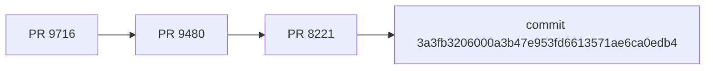

Using only already-hydrated local Git objects, with lazy fetch disabled, the
current engine produced this evidence against destination
`800045c8ab865991f4cec1549de2bb44e76b9904`:

```text
root plan status:    draft_planned / clean_trial_application
planned tree:        2b7467c293ea312349db32372bdc51a495fd419d
coverage status:     covered_by_existing_pr / exact_existing_pull_coverage
covering PR:         https://github.com/ROCm/rocm-systems/pull/10153
covering head:       411a04e98648ef442751e8e219ab9fa1cfb228bf
covering head tree:  2b7467c293ea312349db32372bdc51a495fd419d
source attribution:  true
```

The same local history proves the standalone commit, #8221 merge, and #9480
merge are ancestors of the destination, while the #9716 merge is not. The
covering head records #9716 cherry-pick provenance and exactly matches the
planned tree. Therefore the safe final result is `covered_by_existing_pr`, and
neither a branch nor another PR would be created. This is Git-only structural
assurance: the core deliberately reports native CI as `not_evaluated` and
semantic readiness as `human_review_required`.

Portable regression coverage does not depend on that developer clone. Unit
tests exercise the full typed graph, standalone-commit proof, positive and
negative open-PR coverage matrix, snapshot race guard, and local end-to-end
simulator. The checked-in
`scripts/tests/fixtures/cherry_pick_10153_core_request.json` artifact is a
complete schema-v3 `CoreRequest`, not a summary or legacy request. It freezes
the independently observed #10153 SHAs, typed prerequisite DAG, open-PR
coverage snapshot, and destination head, and can be passed verbatim to
`scripts.cherry_pick.core_cli` whenever the corresponding Git objects are
available locally.

## Implementation status

### Component status

| Component / boundary               | Implemented locally                                                                                  | Locally verified by                                                                    | Production validation still required                                       |
| ---------------------------------- | ---------------------------------------------------------------------------------------------------- | -------------------------------------------------------------------------------------- | -------------------------------------------------------------------------- |
| Product/config contracts           | Generic train-to-destination schema v5, candidate cap, reviewed overrides; no Express/Jira policy    | Strict parser, URL, graph, branch, mode, App-ID, override, and map tests               | Review initial train catalog, override ownership, and production ownership |
| Offline Git core                   | CoreRequest v3, PR/commit proof, containment, open-PR coverage, conflicts, expected-tree planning    | Unit/synthetic tests, #10153 local proof, exact historical pre-merge/known-good replay | Review historical-only gaps and private-runner Git parity                  |
| Prerequisite engine                | Canonical typed trailers/overrides, bounded DAG, commit leaves, deterministic per-destination proof  | Parser, commit, cycle, depth/node, ambiguity, wait, and cross-repository tests         | Operational policy for long-waiting or externally blocked graphs           |
| Authorization                      | Human permission/App-ID checks, label-event binding, AuthorizationEnvelope, continuation snapshot    | Fake timeline/permission/Check pagination and stale/foreign/malformed tests            | Real App identities, audit logs, event ordering, and permission API        |
| GitHub evidence adapter            | Bounded retries, exhaustive pagination, open-PR snapshot/cap, Search and commit-count completeness   | Fake transport tests for success, truncation, malformed evidence, caps, and rates      | GitHub Enterprise policy and live API behavior in a private sandbox        |
| Ref hydration and Git credentials  | Exact refspecs, fork-head support, lazy-fetch/hooks/prompts disabled, process-local auth header      | Local bare remotes and argument/credential-leak tests                                  | Installation-token Git fetch against private sandbox forks                 |
| Planning/write separation          | Immutable artifact, fresh replan, exact fingerprint comparison, plan-scoped authority                | Artifact tamper, drift, ordinary-CLI, and Action-runtime tests                         | Separate real read/write token jobs and artifact retention policy          |
| Draft transaction                  | Rematerialization, second base read, final open-PR snapshot, absent-ref create, exact draft identity | Filesystem remote, base/candidate races, idempotency, fork, ready-PR, tree tests       | Real ref API race behavior, rulesets, draft API, and recovery drill        |
| Feedback and reconciliation        | Typed Check/comment projection and scheduled/manual rediscovery                                      | Total status mapping, sticky comment, malformed artifact, and snapshot tests           | Out-of-order delivery, API outage, retention, and alerting exercise        |
| Reusable workflow and thin callers | Full-SHA pin contract, credential-free preflight, scoped jobs, declared events                       | Cross-file pin checker plus separate workflow, adapter, actionlint, and caller suites  | Publish reviewed rockrel SHA and regenerate all caller pins                |
| Historical regression harness      | 77-row fast/deep corpus, parallel lanes, atomic snapshots, deterministic rollback                    | 31 exact passes, three expected conflicts, serial/parallel byte equality               | Reviewed corpus growth for remaining historical-only cells                 |
| Developer Central config boundary  | Git-reviewed release-train projection, API-token/OIDC read contract, no GitHub writer                | Schema, projection, auth, feature-flag, no-store, and static mutation-boundary tests   | Private OIDC/JWKS and deployed endpoint validation                         |
| GitHub App and operations          | Manifest and least-privilege design only; webhook inactive                                           | Static manifest/workflow tests                                                         | Provisioning, secrets, labels, rules, SLOs, on-call, and incident drill    |

### Current measured local evidence

- The final post-rebuild matrix passes 1,036 tests with no deselections on
  Python 3.10.20, 3.11.15, and 3.12.13 (18.12 s, 17.79 s, and 17.47 s
  respectively). All three reports are identical: 5,470/5,703 lines (95.9144%),
  1,818/1,982 branches (91.7255%), and all 25 named critical modules at or above
  90% in both dimensions.
- TheRock passes three caller tests; rocm-systems and rocm-libraries pass four
  each. Their `c53e703568fe41129abf7139f018ac920bca9c59` pin is intentionally
  stale relative to the dirty local rockrel HEAD.
- Integration checker v2 began with 55 passing and six failing tests, then
  passed 61/61. Its focused measurement is 96.8468% lines and 90% branches, and
  the canonical five-repository report returns `valid: true`. This remains a
  structural equality oracle; behavioral suites own OIDC and workflow behavior.
- Bundle equality, AST closure, and Marketplace qualification pass 37/37, and
  `quick_validate` reports `Skill is valid!`. Manifest v2 records nonpublishable
  `dirty_worktree_review` at base
  `8432a05b8c081df871d426525728de39569ff3cb` with source digest
  `ce9fcd327f311357359bf8f86db88971caf733a042a90e95682ef38b56c1159b`.
- The private-sandbox security suite passes 26/26 after replacing placeholder
  production denylist values with TheRock `765605091`, rocm-systems `962090208`,
  rocm-libraries `971570345`, and rockrel `1071689640`. The CLI remains
  prepare-only; this is not a real sandbox run.
- The complete Release Hub `npm run verify` gate exits zero: scripts 348/348,
  primary frontend 111/111, Developer Central 259/259, a compact
  query-proxy/shared/webhook rerun with 971 success markers and exit zero,
  OpenAPI 90 operations/292 schemas, SQL 546/546, production builds, and Python
  9/9. The OIDC suite passes
  41/41 at 100% line/function/branch coverage; seven backend configuration tests
  reach 100% line/function and 98% branch coverage; eleven API-token UI tests
  reach 100% line/function and 91.3% branch coverage. This run did not deploy,
  push an image, or execute a private sandbox.
- All fourteen Mermaid blocks pass accessibility and local-link validation and
  render to SVG with the immutable-digest renderer, networking disabled, a
  read-only filesystem, dropped capabilities, and no-new-privileges.
- The 17-row fast replay and both 77-row deep runs pass with zero oracle or
  combined-coverage gaps. Deep serial and four-job reports are byte-identical.
- Thirty-one strict historical cases reproduce the exact known-good
  post-cherry-pick tree and then prove containment. Three conflicts match exact
  reviewed paths. Five adaptations remain diagnostics, and 38 inventory-only
  rows are not misrepresented as engine passes.
- Black, mdformat, actionlint, JSON validation, exact coverage policy, and
  `git diff --check` are required gates. All replay worktrees return to verified
  snapshots without a fetch, reclone, or index rebuild.

These are strong local correctness results for the tested state space. They do
not prove flawless behavior, platform availability, or production readiness.

## Known gaps and residual risks

1. **Real GitHub execution is unvalidated.** No installation token, real
   timeline/Check payload, ref creation, draft API call, ruleset, fork fetch, or
   partial-write recovery has run in a private GitHub sandbox.
1. **A production-parity sandbox executor adapter is not implemented.** The
   prepare-only harness proves authorization gates but cannot yet substitute an
   allowlisted private repository and sandbox branch namespace while preserving
   the production planner, writer, token, recovery, and draft-only semantics.
   Designing and reviewing that adapter precedes any real sandbox run.
1. **The destination check and ref creation are not one GitHub transaction.**
   The writer rechecks the base and open-PR snapshot after materialization and
   never updates an existing ref, but either can change immediately after its
   last read. The generated object remains a draft with exact recorded SHAs and
   must pass native CI.
1. **Cross-repository prerequisites are ordered, not atomic.** Managed-stack
   mode creates only the currently unblocked wave and waits for independent
   containment before advancing. Multi-source bundles and TheRock
   component-rollup synthesis remain unsupported.
1. **Conflict and ambiguous equivalence resolution are human work.** The engine
   records evidence and stops; it neither edits conflicts nor infers semantics
   from titles, Jira, Release Hub, newer nightlies, or unrelated gitlink bumps.
1. **Historical evidence is incomplete by shape.** Merge/rebase, executable,
   symlink, binary, gitlink, BKC/staging, planner, writer, and recovery cells
   include deterministic synthetic tests where independently reconstructable
   historical examples are unavailable.
1. **API fail-closed behavior can reduce availability.** Search caps, truncated
   commit lists, missing pages, exhausted retry budgets, or audit evidence
   ambiguity block. Production needs an alert, retry, and escalation policy.
1. **Operational telemetry is not commissioned.** SLOs, dashboards, alert
   routing, token/audit retention, run ownership, and incident exercises have
   not been approved or tested.
1. **Production identities and pins do not exist yet.** `executor_app_id` is
   null, `trusted_app_ids` is empty, the train is `validate`, mutation jobs have
   impossible predicates, and callers intentionally reference a stale test
   SHA.
1. **Platform trust roots remain powerful.** A compromised GitHub administrator,
   runner, executor private key, or reviewed rockrel revision can bypass
   application-layer guarantees and requires organizational incident response.
1. **The local Python matrix is not hosted reviewed-revision evidence.** Python
   3.10.20, 3.11.15, and 3.12.13 each pass the complete 1,036-test post-rebuild
   suite with bundle equality included. Hosted CI from the eventual clean,
   reviewed revision is still required.
1. **Immutable OIDC subjects require remote repository configuration evidence.**
   Repositories created before 2026-07-15 require authorized opt-in under
   GitHub's documented rollout. None was verified or enabled in this local pass.
1. **The review bundle is not publishable provenance.** The rebuilt bundle
   passes byte equality and local structural checks, but its source closure is
   `dirty_worktree_review`. A new build from the clean reviewed commit, hosted
   author/NTID validation, and security scan remain required.

## Local gh credential adapter

The controller has two explicit credential adapters around one planner and one
writer. The production adapter accepts only a scoped `GITHUB_TOKEN` inside
GitHub Actions. The operator adapter accepts only a local github.com `gh`
session, obtains REST credentials through `gh auth token`, and delegates Git
credential lookup to `gh auth git-credential`. Neither adapter enters the
offline core request.

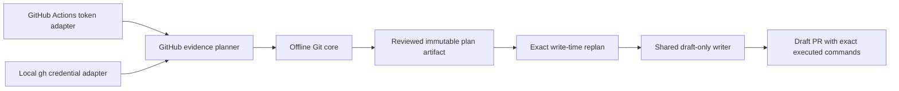

The local writer requires all existing label, permission, dependency,
destination, coverage, and tree proofs. It omits only the executor-App Check
snapshot because planning and writing occur synchronously under the explicit
operator invocation. A literal `CREATE_DRAFT` confirmation is necessary but
not sufficient: train mode must be `create-draft`, both plans must be
`draft_planned`, and identity plus critical evidence must match exactly.

The PR renderer derives one transcript entry from the same
`cherry_pick_command` function used by materialization for each ordered commit.
This prevents the previous multi-commit discrepancy where the body displayed
one combined command although the writer executed multiple commands.

### Local-only materialization transaction

The local operator command is a non-production transaction around the same
planner and offline core. It intentionally converts a PR URL to an immutable
core manifest, but it does not convert an absent label into remote-write
authority.

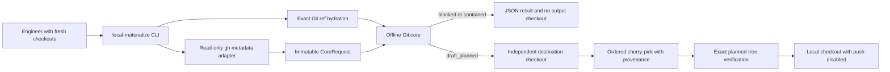

`local_only_operator_request` evidence is accepted only by this materializer.
`revalidate_local_write_authority` rejects it, so a later remote draft request
must return to the ordinary label-authorized plan and exact write-time replan.
The output checkout is created with `--no-hardlinks`, begins at the immutable
destination head, disables the `origin` push URL, runs with hooks disabled, and
is renamed into place only after its tree equals the core's `planned_tree`.
Runtime code has no third-party Python dependency; GitHub CLI is a read adapter,
not part of the core engine.

## SLAI skill packaging and Release Hub adapter

rockrel generates `skills/rocm-cherry-pick` from an explicit runtime allowlist.
The asset contains a location-independent Python launcher, vendored runtime,
schemas, references, Marketplace collateral, and `bundle-manifest.json`. The
version-2 manifest records `source_provenance`: the current rockrel
`base_revision`, either `clean_commit` or `dirty_worktree_review`, and
`source_content_sha256`, the deterministic SHA-256 of the canonical
repository-relative path-to-file-hash map for the exact static and runtime
source closure before transformation. It
also records the skill and core/config/API contract versions and SHA-256 for
every generated file. A clean-commit claim is possible only when Git reports
that complete source closure clean. Dirty local bytes fail closed unless the
operator supplies `--allow-dirty-review`; that explicit output is review-only
and must not be published. Tests regenerate into a
disk-backed temporary directory and compare bytes so the Marketplace runtime
cannot silently drift from the reviewed source.

The builder always emits an explicitly unvalidated pre-scan bundle. Before it
hashes files, it removes scanner-owned `metadata.compliance_scan` and
`COMPLIANCE_*` outputs from both fresh and in-place builds. It preflights every
such path before mutation, rejects directories or other unsafe shapes, and
then regenerates the manifest. Consequently any source or runtime rebuild
invalidates an earlier scan by construction. Author, security, and submission
validation must run against the exact post-build bundle; an older report cannot
be copied forward as evidence.

The Developer Central adapter is outside the pure Git core. It calls
`GET /api/v1/cherry-pick/config` with a local `read:evidence` bearer token or
a GitHub Actions OIDC token, validates the complete
`cherry-pick-config.v1` projection and `release-trains.v5` source digest, and
writes the selected immutable train snapshot into the core request. Required
fields include request ID, source hash, explicit repository source branches,
mode, dependency mode, reviewed override graph, confirmed destination records,
and exact destination refs. The Git adapter then fetches current refs; no
historical creation SHA substitutes for a current head. There is no bundled
active catalog or last-known runtime fallback.

Credential precedence is explicit: `ROCM_RELEASE_HUB_TOKEN`, then the
API-keyed `rrh-auth.v1` file. Login accepts a hidden prompt, stdin, or a private
regular file and rejects argv tokens, symlinks, permissive files, and malformed
values. When no usable token exists, output contains only the canonical
Developer Central API-token URL and setup steps. The default API origin is
`https://developer-central.amd.com`, overridden only by `--api` or
`ROCM_RELEASE_HUB_API`; non-loopback HTTP is rejected.

The rebuilt local-review bundle is deliberately nonpublishable
`dirty_worktree_review` at base revision
`8432a05b8c081df871d426525728de39569ff3cb`. Its exact source-closure digest is
`ce9fcd327f311357359bf8f86db88971caf733a042a90e95682ef38b56c1159b`.
Bundle equality, AST closure, and Marketplace qualification pass 37/37, and
`quick_validate` reports `Skill is valid!`. Publication still requires a new
build from the later clean reviewed commit.

Local validation runs the structural SLAI validator and deterministic package
tests. Hosted author/NTID validation and the mandatory security scan must then
run against the exact clean rebuilt bundle before a submission dry-run. Their outputs
are scanner-owned and are never treated as valid after another rebuild. A live
submission remains a separately authorized remote action.

## TODOs and next steps

The authoritative mutation checklist is `REMOTE_ACTIONS_TODO.md`. Nothing in
this section authorizes those actions. Advancement is evidence-gated:

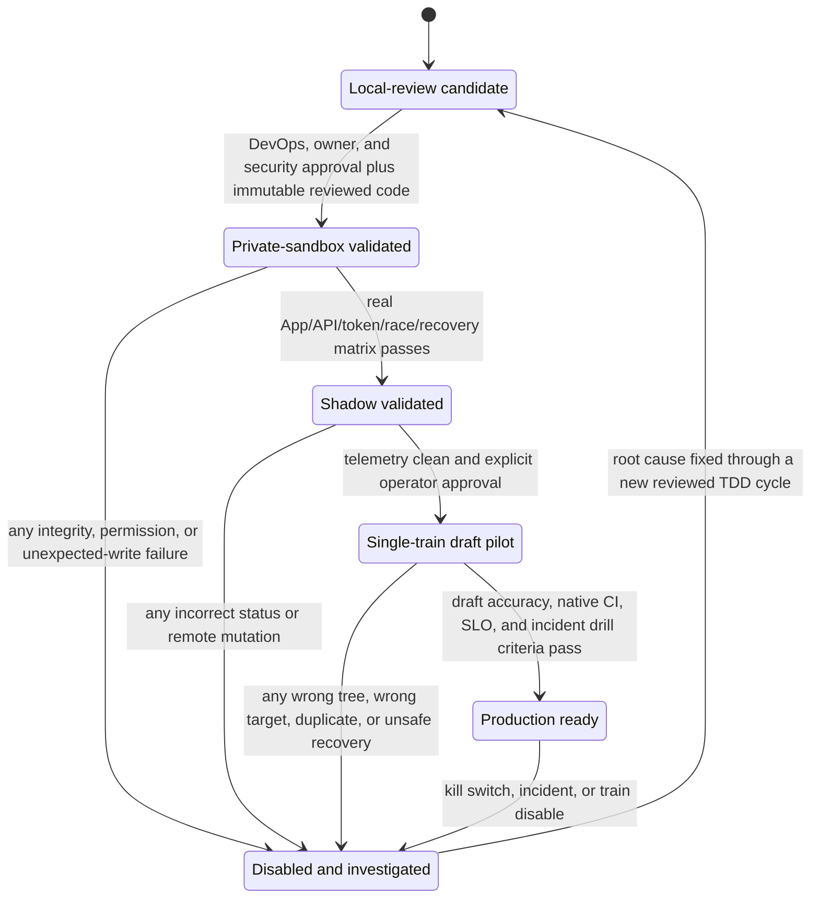

### Gate 1: human design and diff review

1. Review the PRD, this design, threat model, implementation report, runbook,
   full rockrel diff, three caller diffs, replay oracle, and residual risks.
1. Review the SVG output from all fourteen diagrams rendered by the
   immutable-digest, network-disabled Mermaid CLI; treat any parse,
   accessibility, duplicate-title, or local-link issue as blocking.
1. Obtain explicit ROCm DevOps, repository-owner, security, and operations
   sign-off. Resolve every blocking review comment through tests-first changes.
1. Decide production ownership, incident severity, audit retention, SLOs,
   support rotation, and the kill-switch operator.

### Gate 2: private GitHub sandbox

1. Create a dedicated least-privilege executor App in an approved private test
   organization; record its exact numeric ID and isolate its credentials.
1. Publish reviewed automation only to the approved sandbox and regenerate test
   callers from its immutable full SHA.
1. Exercise squash, merge commit, ordered rebase, fork PR, typed prerequisites,
   already-contained, conflict, ambiguous no-op, edited/synchronized PR,
   unauthorized labeler, stale snapshot, API truncation/rate limit,
   destination movement, concurrent duplicate events, and branch-created/
   PR-failed recovery.
1. Verify token scopes, log redaction, artifact contents, audit attribution,
   branch rules, native CI, Check/comment ordering, retry budgets, and that
   every created PR remains a draft.
1. Run the disable/rollback and credential-revocation incident drills. Any
   unexpected write or unexplainable state returns the design to local review.

### Gate 3: reviewed deployment and shadow

1. Review and publish rockrel first; record the immutable production SHA.
1. Regenerate and review each source caller against exactly that SHA. Never
   activate the current stale pins.
1. Provision approved production App installation, secrets, labels, rulesets,
   environments, required checks, monitoring, and alert routing.
1. Keep trains in `validate`, then promote one reviewed train to `shadow`.
   Compare decisions with human operators and require zero unexplained results
   over the approved observation window.

### Gate 4: draft-only canary and production decision

1. Promote one low-risk train to `create-draft` through a separate reviewed
   configuration change and explicit operator approval.
1. Verify every canary source, target, dependency, expected tree, provenance,
   draft identity, native CI result, and retry/reconciliation outcome.
1. Require the operator-approved accuracy, latency, availability, and incident
   thresholds. Only then record a production-ready decision.
1. Continue to forbid automatic ready/approve/merge/close/delete operations.
   Human repository owners retain final integration authority.

Rollback at every stage disables the train or restores caller pins. Existing
branches and drafts are preserved for disposition; automation never deletes
them. Release Hub remains a read-only observer throughout rollout and rollback.
